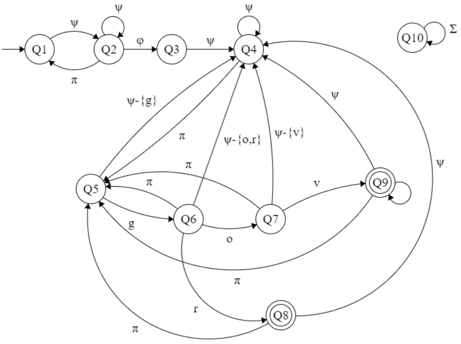

# DFA illustration

#### Author: [Andrew Gyakobo](https://github.com/Gyakobo)

## Intro
* The following example is meant to demonstrate how a Deterministic Finite Automata(DFA) algorithm is supposed to guide identify whether a string is an email adress ending with **.gov** or **.gr**. The source file [dfa.py](https://github.com/Gyakobo/Recognizing_an_email_adress_with_DFA/blob/main/dfa.py) would serve as a demonstration of the aforementioned algorithm.

## In-depth analysis of 'L'
* Given the Lanaguage "L", it is defined over an alphabet $\Sigma$, also defined as $\Sigma = \psi \cup \pi \cup \phi$

    * $\psi$ = {a, b, ..., z} 
    * $\pi$ = {.} 
    * $\phi$ = {@} 

* Let's now fully 'L', so $L = S_{1}S_{2}^* \phi S_{1}S_{2}^*(S_{3} \cup S_{4})$, where: 

    * $ S_{1} = \psi \psi^* $ (numbers of at least length 1)
    * $ S_{2} = \pi \psi \psi^* $ (strings of $ S_{1} $ beginning with a dot)
    * $ S_{3} $ = {.gov} (valid enging for email adress)
    * $ S_{4} $ = {.gr} (valid enging for email adress)

* Delving more into discrete math, language 'L' is a regular language and as later on proved there exists a DFA which recognizes said regular language. 

## Deterministic Finite Automaton(DFA) M for Language L
5-Tuple Definition for $ M = (Q, \Sigma, \delta, Q_{1}, F) $

* $ Q = \{ Q_{1}, Q_{2}, Q_{3}, Q_{4}, Q_{5}, Q_{6}, Q_{7}, Q_{8}, Q_{9}, Q_{10} \} $
* $ \Sigma = \psi \cup \pi \cup \phi $
* $ \delta: Q × \Sigma \rightarrow Q $

| Q | $\psi-\{o,r,g,v\}$ | $\pi$ | $phi$| o | r | g | v |
|---|---|---|---|---|---|---|---|
| Q1  | Q2 | Q10 |   |   |   |   |  
| Q2  | Q2 | Q1 |   |   |   |   |
| Q3  | Q4 | Q10 |   |   |   |   |
| Q4  | Q4 | Q5 |   |   |   |   |
| Q5  | Q4 | Q10 |   |   |   |   |
| Q6  | Q4 | Q5 |   |   |   |   |
| Q7  | Q4 | Q5 |   |   |   |   |
| Q8  | Q4 | Q4 |   |   |   |   |
| Q9  | Q4 | Q5  |   |   |   |   |
| Q10 | Q10 | Q10 | Q10 | Q10 | Q10 | Q10 | Q10 |   

## Drawing the DFA M 

> Note: Please note that the state "Q10" is a trap state for non-specified edges

## License:
MI